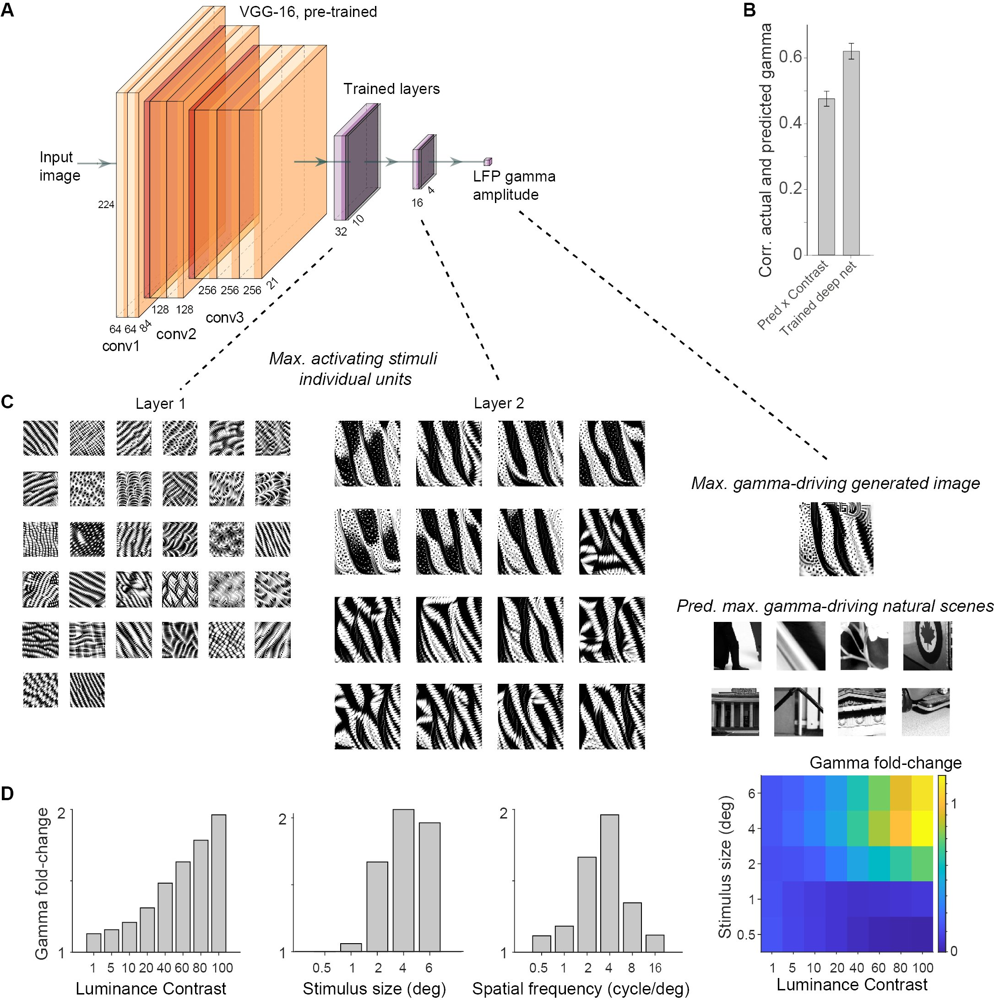

# gamma-net



We used a convolutional neural network to predict γ-peaks based on the input image. In total, training data consisted of 31988 image patches, by pooling across monkeys, channels and sessions. We used all image patches from a unique 10% of the stimuli as a test set and used the rest for training. We resized the 224x224 image patches to 84x84 in order to reduce the number parameters in the network. We used the VGG-16 model from keras applications, with frozen weights pre-trained on ImageNet for transfer learning. The VGG-16 activations were the input to a network that consisted of 2 convolutional layers and a readout layer. We compared predictions from different VGG-16 input layers, and for the main examples of RFs used conv3 3 as input (Figure 6). Convolutional layers consisted of (3x3) filters with bias, stride (2), valid padding, L1-norm kernel regularization (0.001), leaky ReLU activation (0.1), and dropout (0.5). The final two convolutional layers had 32 and 16 units. The readout layer consisted of (4x4) filters with bias and leaky ReLU activation (0.1). 


For more details, please see the methods part of our paper:

[Predictability in natural images determines V1 firing rates and synchronization: A deep neural network approach](https://www.biorxiv.org/content/10.1101/2020.08.10.242958v1) 


# Installation

Clone/Fork the repository to use the scripts.

```shell
git clone https://github.com/uranc/gamma-net.git
```

## Requirements
tensorflow v1.14, keras-contrib
```shell
pip install tensorflow==1.14
pip install git+https://www.github.com/keras-team/keras-contrib.git
```

# Usage

## Command-Line

You can use the pre-trained model based on VGG-16 to predict gamma peak value in log10 space. Requires the input data to be a numpy array.

```shell
python pred.py --mode predict --model a3 --input examples/sample.npy
```

Input size is fixed to be 224x224

Requires TFRecords as an input file

```shell
python pred.py --mode train --model save_name
```


## Jupyter notebook

- paper figure 

# To Do List
  - TFRecords documentation / loss function for training
  - cleanup / comment
  
# New Features  
  - directory of images
  - numpy
  


