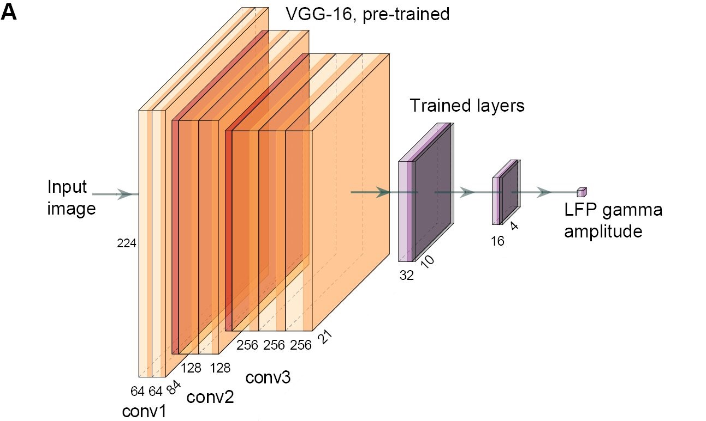

# gamma-net

[Predictability in natural images determines V1 firing rates and synchronization: A deep neural network approach](https://www.biorxiv.org/content/10.1101/2020.08.10.242958v1) 





## Requirements
tensorflow v1.14, keras-contrib
```shell
pip install tensorflow==1.14
pip install git+https://www.github.com/keras-team/keras-contrib.git
```
